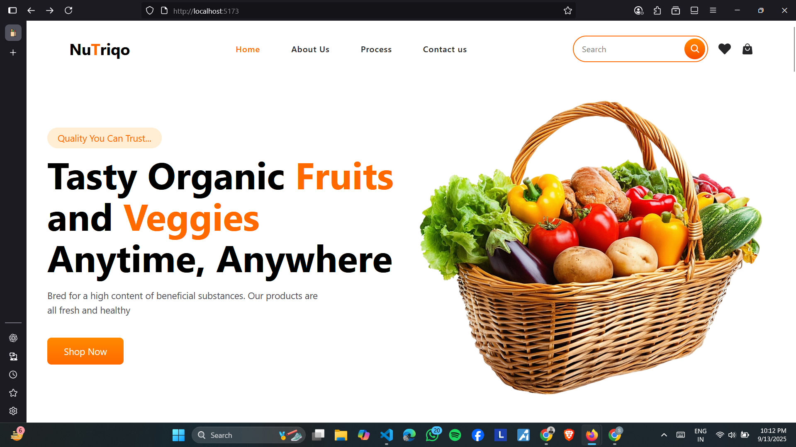

🛒 Grocery E-Commerce Website 

A modern and responsive grocery e-commerce website built with React.js, designed to showcase fresh organic products like fruits, dairy, seafood, and more.

📌 Features

🌟 Responsive UI – works across desktop, tablet, and mobile.

🏷 Category-based browsing (Fruits, Dairy, Seafood, All Products).

🎨 Modern design with Tailwind CSS styling.

⚡ Reusable components (Navbar, Hero, Products, Testimonials, etc.).

🛍 Call-to-action (Shop Now) buttons for better conversions.

🧾 Clean folder structure for scalability.

🚀 Getting Started
1️⃣ Clone the repository
git clone https://github.com/your-username/grocery-ecommerce.git
cd grocery-ecommerce

2️⃣ Install dependencies
npm install

3️⃣ Run the development server
npm run dev

4️⃣ Build for production
npm run build

🛠 Tech Stack

React.js – component-based frontend library.

React Router – for navigation and routing.

Tailwind CSS – modern utility-first styling.

Vite – fast development server & build tool.

📸 Preview

👨‍💻 Author

Developed by Supratim Mandal (Samrat) 🚀